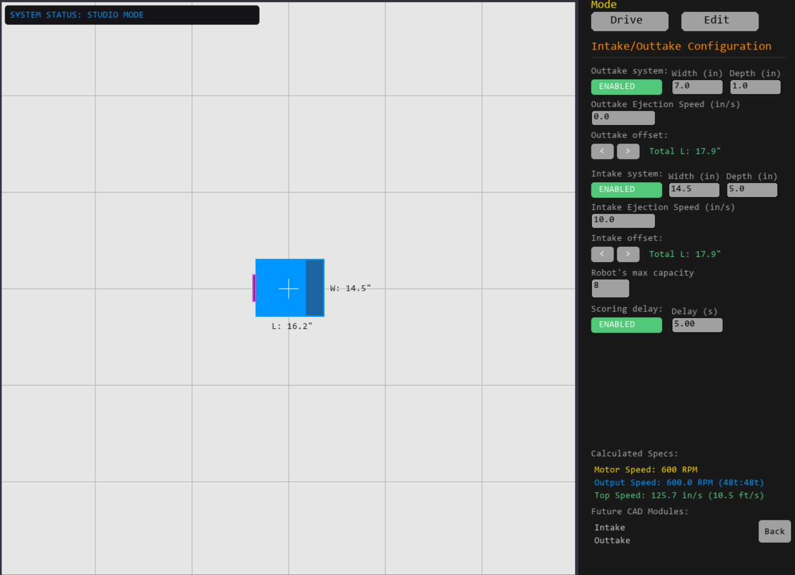
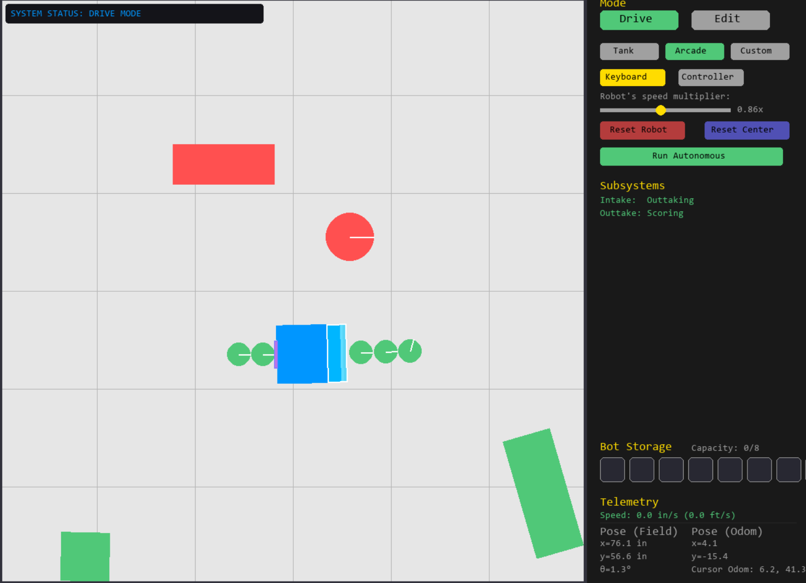
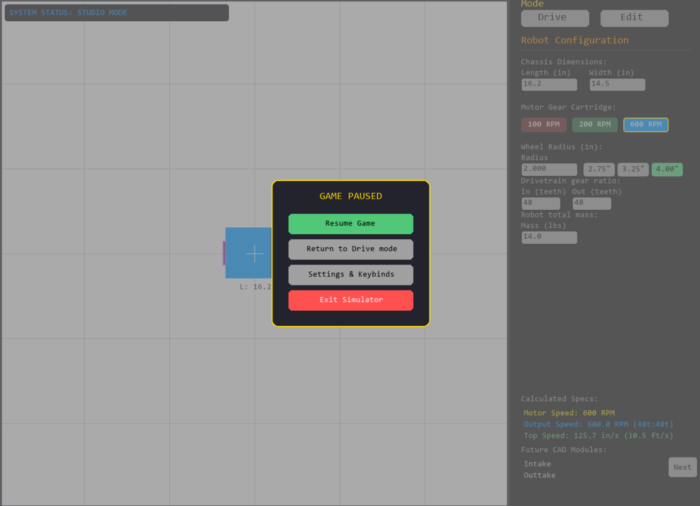
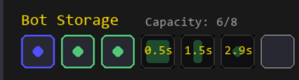
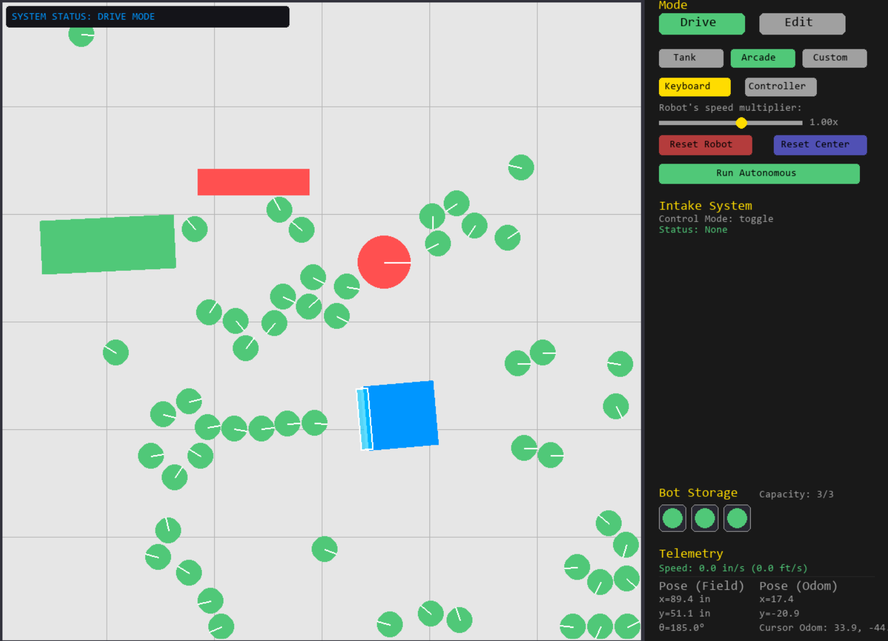

This Dev's journal documents my ideas and initial designs/thoughts for the VEX driving simulator, along with my progress I'm working on in "main.py".
For instructions on how to use and improve the simulator, go to "TUNING_GUIDE.md"

Engineering Log: Architectural Design Decisions

[July 18, 2026] - Shifting to PyMunk Rigid-Body Physics (This is transferred from the "README.md" to clean up the README space)

===The Problem=== In the legacy version of the simulator, the robot chassis boundaries were locked using manual coordinate clamping (bot.x = max(...)). This created a major bug where the corners of the chassis would clip straight into the walls. When driving into a barrier at an angle, the corner would get stuck and slide upward instead of showing realistic physics behavior—like taking the impact force at that specific angle and swinging the robot around to face the wall flatly.

===Brainstorming & Solutions=== I looked into two different ways to use PyMunk to handle these corner collisions and bring in realistic mechanics:
_ 1. Raw Force Model (Independent Left/Right Drivetrain Forces): Pushing the robot by applying raw forces to the left and right sides individually. While this sounds highly realistic, a top-down simulation view can create the impression that the robot drifts endlessly because no tire-friction forces are calculated. Fixing this would require massive custom math equations every single frame to keep track of directions and counter-forces.
_ 2. Velocity-Controlled Two-Wheel Bridge (Chosen Strategy): Instead of raw forces, we compute the robot's linear and angular velocities from the controller inputs and feed these vectors directly into a dynamic PyMunk body every frame.

===Why Option 2 Wins=== After digging into PyMunk's documentation and seeing what the library can do, I naturally landed on Option 2. It lets PyMunk handle the heavy math under the hood rather than forcing me to track independent directional forces every frame for Option 1 manually:
_Natural Rotational Torque: When hitting a wall at a 45-degree angle, PyMunk's internal collision solver calculates an instant impulse force right on the hitting corner. Because this force acts away from the center of mass, it naturally counteracts the chassis' speed and pivots the robot flat against the wall, mimicking how a real VEX drivetrain would interact with the field's walls. 
_No Drifting: It completely bypasses the drifting bug. The moment the driver releases the joysticks to zero, the velocity drops to zero, giving the robot snappy, realistic traction on the field tiles, rather than Option 1, where individual calculations try to adjust forces and create more room for error.

[July 23, 2026] - Planning and sketching for the next steps of the simulator

===Personal Comments and an Unexpected Problem=== Now that the simulator has gotten the basic physics, like ball collisions, non-movable walls, realistic friction and energy loss upon impact, objects having mass and momentum (how hard to accelerate), it can be used as a practice simulator for driving and maneuvering around the current year's game layout. But a new problem came: this simulator would be great for last year's game when the idea for the simulator started -"Push-Back" requires a lot of defending and movement for de-scores, along with a "perfect" auton-run to ensure control - but this year (according to my personal judgment) requires a lot more tactics and robot percision which depends more on the actual robot design. The current simulator doesn't have many abilities to create a "mock" practice run, like picking and dropping pins, rolling bars, and having other bots compete for the middle spot; I realized that the simulator would need to be more customizable to match the yearly game changes. Thus, I brainstormed sketches for a better (more control and options) simulator that would feel like an actual game so that a new team, which doesn't have someone to understand the code, can still use the sim to its full potential.

===Sketches for future simulator (that would be turned into a "game" rather than "sim")===
Sketch of the paused screen and different screens that would happen depending on what option is chosen (Keybinds, Overall Settings, Robot Design-now called Studio Mode)

Sketch of a more detailed layout and structure of "Keybinds" (ideas for a keyboard- and controller-compatible game along with some keybinds to have)

Sketch of a more detailed layout and structure of the "Overall Settings" modal (ideas of what functions and variables the user can change)

Sketch of a more detailed layout of the Robot Design workplace (now called Studio)

Includes future plans and a working-in-progress function: The ability to add different layers to the robot that would behave differently to the environment, depending on which layer that part of the bot is on (bottom, middle, or top)

This is what I, for now, intend to work on over the next few days, and I will be following those sketches pretty closely (orrr not, just have to see :) )

[July 27, 2026] - Designing and brainstorming process for Intake/Outake system in Drive mode

===The "problem"=== When designing the collection mechanics for the intake and outtake systems, I needed to determine how game elements (rings/triballs/blocks/ect.) interact with the front intake zone during Drive Mode. Two routes came up:

_Approach A: Passive collision detection
+How it works: The instant a dynamic game piece enters the intake bounding box, the physics engine automatically despawns it from the field and appends it to the robot's inventory list.
+Pros: Simple to implement. Requires no extra control inputs or keybinding infrastructure.
+Cons: Unrealistic. Drivers lose tactical control; they can't choose when to ignore an element or push it across the field without sucking it in.

_Approach B: Active keybind/ User controlled intake
+How it works: Collection triggers only if a dynamic object overlaps with the intake zone AND the driver is actively pressing/holding the designated intake keybind
+Pros: It gives the user way more control over the robot and its function, allowing for personalized keybinds and a more realistic competition feel. Enables reverse-intaking
+Cons: Requires building a dynamic keybinding engine, expanding settings.json persistence (save_settings() / load_all_data()), and adding a key mapping menu to the Pause modal.

===Why approach "B" wins=== Although building custom keymapping and data persistence requires more setup initially, it aligns directly with the long-term roadmap I had. To maximize usability across both controller and keyboard players, I am implementing a customizable toggle setting in the Keybind config - users can choose to turn the intake on or off from one button or choose to hold the button to activate. Controller users prefer to hold the intake (mimicking the real VEX controller trigger that my team has), while keyboard users will benefit heavily from toggle intake.

[July 31, 2026] - Limited space problem in Edit and Studio mode

===The Problem=== When I began to work on the outtake system in Studio mode today, I ran into a problem where there is little to no sidebar space available for me to use, and the sidebar began to look crowded and confusing, just like Edit mode's sidebar. So I began looking for a solution to expand the available space while keeping it simple enough to reduce unnecessary power/lag (my laptop is small :(, so I have to optimize this simulator).

===The Thinking=== The first thing I thought of was a scrollable sidebar, but that would require a complete rework of the button coordinate system - currently a fixed X and Y - and would overcomplicate the simple problem of "I'm running out of space". Thus leading to my next and current idea, which is a button that switches from one page to another

===How it works=== In draw_everything(), it will now keep track of a separate global variable, current_page ("studio 1"/ "studio 2"/ "edit 1"/ "edit 2"), along with current_mode ("edit"/ "drive"/ "studio"), and it will only draw page-specific buttons using conditional logic
===Why it works=== Having this numbering and conditional logic system allows me to expand the space to my liking - going up to "studio 20" and such - then it will turn into a problem of keeping everything in order and engaging enough for the user
===However!?! + future plan=== This UI system would only work for the Edit and Studio mode sidebar, but not the settings modal, because most users would expect a scrollable page for settings like "keybinds," where a lot of customization and freedom need to happen. So eventually, I would have to find a way to make a scrollable page along with configurable buttons with persistence in that page. 

[August 2, 2026] - Update on the simulator/ documentation (with pictures, who doesn't love em 🔥)

Sidenote: I just discovered how to add emojis, and I will try and start using them; I just thought that I might be able to give more "life" to this longgg documentation
Studio mode now displays the outtake (left side) on the CAD along with the intake (right side), and the user can configure its attributes on the sidebar. Additionally, studio mode and edit mode now have 2 sidebars, which I will sometimes call sidebar 1/2 or ___ mode page 1/2, meaning the limited space problem on July 31st has been fixed and the UI are much cleaner now

Not just the outtake appearing in Studio mode CAD/display model; it works in Drive mode too!! 🥳

[Unknown date, after Aug 2nd] - Fix the simulator according to M's suggestion (I gotchu bro🙂)

One of my early testers, who is also my teammate, had questioned why I have the paused menu for Drive and Edit mode but not Studio mode. Before that, the user would have to click back on "Drive" or "Edit" at the top of the sidebar to exit Edit mode, and it would be naturally logical that the user used the pause menu to get to Edit mode, so they also use the pause menu to get out of it. So I fixed that, with some custom text saying "Return to drive mode" in Studio to make sure they know :)

[August 3rd, 2026] - Gamifying the simulator through UI works

As I said before, I wanted to make this simulator feel less of a "sim" and more of a "game" where everyone can enjoy, mess around, and test their robot on a semi-realistic practice program. That is why I added what most "gamers" would call a "cooldown" for the robot's outtake. Originally, I wanted to simulate the realistic feeling of the game element needing to traverse inside the robot after being taken in order to score out of the outtake - so I added a delay timer in Studio mode sidebar 2 where the object would be outtake after a certain period of time (s), of course, while their outtake is on.

In the game (I would like to call it now, rather than simulator), the inventory display in Drive mode would now have a countdown over each object:

(Also, if you noticed, the display would now show a smaller version of the Dynamic object that got taken in! Like the circles, the rectangles along with their color - so that brings out the feeling of the game too!!!🎮)

[Game dev having fun] - This end part would be where I show the "fun" and "interesting" bugs I came across while working on this project (that I ABSOLUTELY love!!!) so have some fun while going from now on

Disclaimer: These would be images that I have taken on various dates, so I can't give you the exact date, sorry!

The robot has gone out of control and kept outtakinggg!

