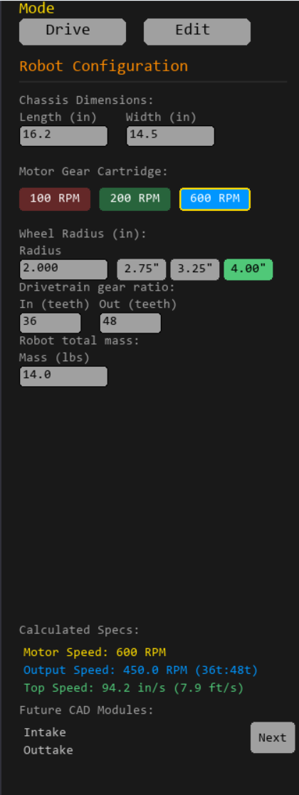
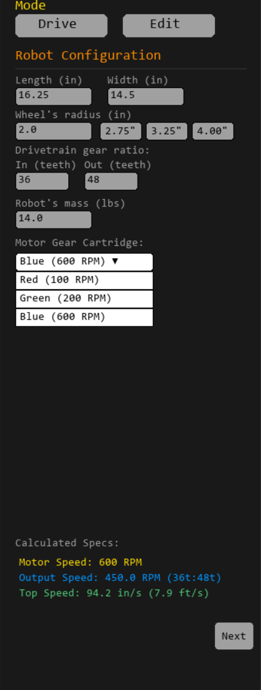
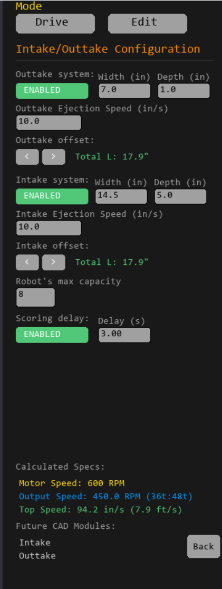
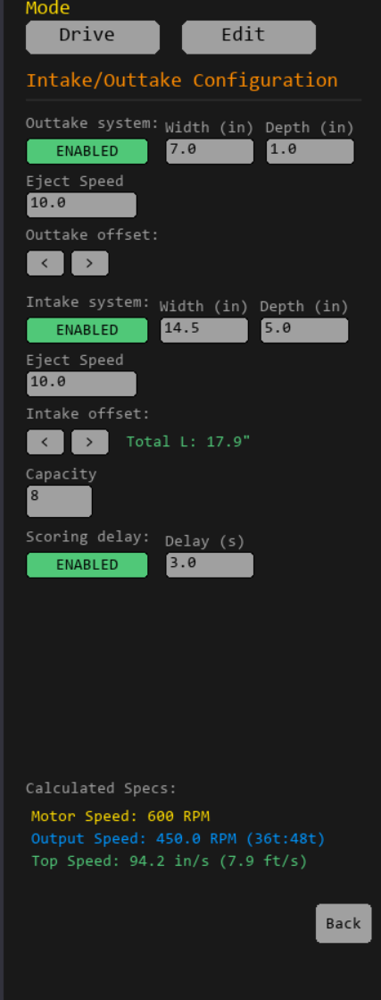

This Dev's journal documents my ideas and initial designs/thoughts for the VEX driving simulator, along with my progress I'm working on in "main.py".
For instructions on how to use and improve the simulator, go to "TUNING_GUIDE.md"

Engineering Log: Architectural Design Decisions

[July 18, 2026] - Shifting to PyMunk Rigid-Body Physics (This is transferred from the "README.md" to clean up the README space)

===The Problem=== In the legacy version of the simulator, the robot chassis boundaries were locked using manual coordinate clamping (bot.x = max(...)). This created a major bug where the corners of the chassis would clip straight into the walls. When driving into a barrier at an angle, the corner would get stuck and slide upward instead of showing realistic physics behavior—like taking the impact force at that specific angle and swinging the robot around to face the wall flatly.

===Brainstorming & Solutions=== I looked into two different ways to use PyMunk to handle these corner collisions and bring in realistic mechanics:
_ 1. Raw Force Model (Independent Left/Right Drivetrain Forces): Pushing the robot by applying raw forces to the left and right sides individually. While this sounds highly realistic, a top-down simulation view can create the impression that the robot drifts endlessly because no tire-friction forces are calculated. Fixing this would require massive custom math equations every single frame to keep track of directions and counter-forces.
_ 2. Velocity-Controlled Two-Wheel Bridge (Chosen Strategy): Instead of raw forces, we compute the robot's linear and angular velocities from the controller inputs and feed these vectors directly into a dynamic PyMunk body every frame.

===Why Option 2 Wins=== After digging into PyMunk's documentation and seeing what the library can do, I naturally landed on Option 2. It lets PyMunk handle the heavy math under the hood rather than forcing me to track independent directional forces every frame for Option 1 manually:
_Natural Rotational Torque: When hitting a wall at a 45-degree angle, PyMunk's internal collision solver calculates an instant impulse force right on the hitting corner. Because this force acts away from the center of mass, it naturally counteracts the chassis' speed and pivots the robot flat against the wall, mimicking how a real VEX drivetrain would interact with the field's walls. 
_No Drifting: It completely bypasses the drifting bug. The moment the driver releases the joysticks to zero, the velocity drops to zero, giving the robot snappy, realistic traction on the field tiles, rather than Option 1, where individual calculations try to adjust forces and create more room for error.

[July 23, 2026] - Planning and sketching for the next steps of the simulator

===Personal Comments and an Unexpected Problem=== Now that the simulator has gotten the basic physics, like ball collisions, non-movable walls, realistic friction and energy loss upon impact, objects having mass and momentum (how hard to accelerate), it can be used as a practice simulator for driving and maneuvering around the current year's game layout. But a new problem came: this simulator would be great for last year's game when the idea for the simulator started -"Push-Back" requires a lot of defending and movement for de-scores, along with a "perfect" auton-run to ensure control - but this year (according to my personal judgment) requires a lot more tactics and robot percision which depends more on the actual robot design. The current simulator doesn't have many abilities to create a "mock" practice run, like picking and dropping pins, rolling bars, and having other bots compete for the middle spot; I realized that the simulator would need to be more customizable to match the yearly game changes. Thus, I brainstormed sketches for a better (more control and options) simulator that would feel like an actual game so that a new team, which doesn't have someone to understand the code, can still use the sim to its full potential.

===Sketches for future simulator (that would be turned into a "game" rather than "sim")===
Sketch of the paused screen and different screens that would happen depending on what option is chosen (Keybinds, Overall Settings, Robot Design-now called Studio Mode)

Sketch of a more detailed layout and structure of "Keybinds" (ideas for a keyboard- and controller-compatible game along with some keybinds to have)

Sketch of a more detailed layout and structure of the "Overall Settings" modal (ideas of what functions and variables the user can change)

Sketch of a more detailed layout of the Robot Design workplace (now called Studio)

Includes future plans and a working-in-progress function: The ability to add different layers to the robot that would behave differently to the environment, depending on which layer that part of the bot is on (bottom, middle, or top)

This is what I, for now, intend to work on over the next few days, and I will be following those sketches pretty closely (orrr not, just have to see :) )

[July 27, 2026] - Designing and brainstorming process for Intake/Outake system in Drive mode

===The "problem"=== When designing the collection mechanics for the intake and outtake systems, I needed to determine how game elements (rings/triballs/blocks/ect.) interact with the front intake zone during Drive Mode. Two routes came up:

_Approach A: Passive collision detection
+How it works: The instant a dynamic game piece enters the intake bounding box, the physics engine automatically despawns it from the field and appends it to the robot's inventory list.
+Pros: Simple to implement. Requires no extra control inputs or keybinding infrastructure.
+Cons: Unrealistic. Drivers lose tactical control; they can't choose when to ignore an element or push it across the field without sucking it in.

_Approach B: Active keybind/ User controlled intake
+How it works: Collection triggers only if a dynamic object overlaps with the intake zone AND the driver is actively pressing/holding the designated intake keybind
+Pros: It gives the user way more control over the robot and its function, allowing for personalized keybinds and a more realistic competition feel. Enables reverse-intaking
+Cons: Requires building a dynamic keybinding engine, expanding settings.json persistence (save_settings() / load_all_data()), and adding a key mapping menu to the Pause modal.

===Why approach "B" wins=== Although building custom keymapping and data persistence requires more setup initially, it aligns directly with the long-term roadmap I had. To maximize usability across both controller and keyboard players, I am implementing a customizable toggle setting in the Keybind config - users can choose to turn the intake on or off from one button or choose to hold the button to activate. Controller users prefer to hold the intake (mimicking the real VEX controller trigger that my team has), while keyboard users will benefit heavily from toggle intake.

[July 31, 2026] - Limited space problem in Edit and Studio mode

===The Problem=== When I began to work on the outtake system in Studio mode today, I ran into a problem where there is little to no sidebar space available for me to use, and the sidebar began to look crowded and confusing, just like Edit mode's sidebar. So I began looking for a solution to expand the available space while keeping it simple enough to reduce unnecessary power/lag (my laptop is small :(, so I have to optimize this simulator).

===The Thinking=== The first thing I thought of was a scrollable sidebar, but that would require a complete rework of the button coordinate system - currently a fixed X and Y - and would overcomplicate the simple problem of "I'm running out of space". Thus leading to my next and current idea, which is a button that switches from one page to another

===How it works=== In draw_everything(), it will now keep track of a separate global variable, current_page ("studio 1"/ "studio 2"/ "edit 1"/ "edit 2"), along with current_mode ("edit"/ "drive"/ "studio"), and it will only draw page-specific buttons using conditional logic
===Why it works=== Having this numbering and conditional logic system allows me to expand the space to my liking - going up to "studio 20" and such - then it will turn into a problem of keeping everything in order and engaging enough for the user
===However!?! + future plan=== This UI system would only work for the Edit and Studio mode sidebar, but not the settings modal, because most users would expect a scrollable page for settings like "keybinds," where a lot of customization and freedom need to happen. So eventually, I would have to find a way to make a scrollable page along with configurable buttons with persistence in that page. 

[August 2, 2026] - Update on the simulator/ documentation (with pictures, who doesn't love em 🔥)

Sidenote: I just discovered how to add emojis, and I will try and start using them; I just thought that I might be able to give more "life" to this longgg documentation
Studio mode now displays the outtake (left side) on the CAD along with the intake (right side), and the user can configure its attributes on the sidebar. Additionally, studio mode and edit mode now have 2 sidebars, which I will sometimes call sidebar 1/2 or ___ mode page 1/2, meaning the limited space problem on July 31st has been fixed and the UI are much cleaner now

Not just the outtake appearing in Studio mode CAD/display model; it works in Drive mode too!! 🥳

[Unknown date, after Aug 2nd] - Fix the simulator according to M's suggestion (I gotchu bro🙂)

One of my early testers, who is also my teammate, had questioned why I have the paused menu for Drive and Edit mode but not Studio mode. Before that, the user would have to click back on "Drive" or "Edit" at the top of the sidebar to exit Edit mode, and it would be naturally logical that the user used the pause menu to get to Edit mode, so they also use the pause menu to get out of it. So I fixed that, with some custom text saying "Return to drive mode" in Studio to make sure they know :)

[August 3rd, 2026] - Gamifying the simulator through UI works

As I said before, I wanted to make this simulator feel less of a "sim" and more of a "game" where everyone can enjoy, mess around, and test their robot on a semi-realistic practice program. That is why I added what most "gamers" would call a "cooldown" for the robot's outtake. Originally, I wanted to simulate the realistic feeling of the game element needing to traverse inside the robot after being taken in order to score out of the outtake - so I added a delay timer in Studio mode sidebar 2 where the object would be outtake after a certain period of time (s), of course, while their outtake is on.

In the game (I would like to call it now, rather than simulator), the inventory display in Drive mode would now have a countdown over each object:

(Also, if you noticed, the display would now show a smaller version of the Dynamic object that got taken in! Like the circles, the rectangles along with their color - so that brings out the feeling of the game too!!!🎮)

[August 8th, 2026] - A rework in the game's UI system

As the game keeps growing, I really realize the limitations of my old way of doing UI's and its backend functions (saving, loading, clicking, typing). Hardcoding exact X and Y coordinates for every single button and text boxes was fine at the start but now I'm getting to the part (where I previously mentioned) that I would need a scrollable list of keybinds to accommodate the new functions and my goal for the most customizable game

I did some brainstorming with my AI "co-dev" to figure out how actual game devs and studios handle this scrolling challenge. Instead of a quick way of doing this (using the current way of drawing and constantly showing and hiding certain text boxes as the user scrolls), we decided to completely overhaul the structure to a "Data-Driven Component System", similar to what engines like Unity uses (better performance, simply attaching and detaching data components, and clean)

The UIElement class: Everything is an object now. We created a base class that keeps track of a local_rect (inside a menu, based on the screen_rect) and a screen_rect (base one)

Seperating UI classes to a new ui.py file: I moved all this new UI logic into its own completely independent file. Now main.py can just focus on the robot physics and game loops without being cluttered by hundreds of lines of menu math.

The ScrollView class: Where the scrolling happens. It acts as a parent container that holds a list of UI elements/children. When you scroll the mouse wheel, it automatically shifts the Y-coordinates of all its children and uses Pygame's set_clip() function to hide anything that is not inside the set range.

We built and tested the components with simple buttons first and then completely ripped out the old "Keybinds and Settings" modal draw_everything() and handle_ui_clicks(). Now adding a new button is as simple as "settings_scrollview.add_child()", no more 20+ hardcoded rectangles for textboxes and .collidepoint conditions in the main loop - Dev note: it feels like a real game now :) And expanding the game in the future with this new structure would be so much easier 🍋

[August 10th, 2026] - A revamp in the Studio mode UI (using the new class objects from "ui.py")

Along with UIElement and UIScrollview mentioned on August 8th, I also created UIButton and UITextbox classes in "ui.py". So today I began replacing the old hardcoded UI rects with the new object-based structure, and I decided to start with Studio mode.

Because the new structure uses objects from classes, I can append them to a rendering list, which I can loop through and render in draw_everything(). Additionally, the rect declaration, the function of what to do, and rendering are all done through the class, meaning I no longer need separate global declarations, nor do I have to write out manual checks inside apply_textbox_value() for textboxes or handle_ui_click() for buttons - so not just shortening my code, but it also makes it easier to add a new button and keep the main file so much cleaner (I do still need handle_ui_click() to pass the mouse click coordinates down to the classes so they can do their function detection - like what dropdown option were picked)

Overall, after replacing the new code, I have shortened the simulator code by ~15 functioning lines (not counting for spaces/ empty line for comprehensibility)

Visual demonstration of the effectiveness and look of the old and new versions.

Before:  After: 

Before:  After: 

[August 15th, 2026] - A disadvantage of the virtual simulator, and brainstorming how to fix it

One of the main reasons I built this simulator is the limitation of my school's robotics room: we only have one field to drive, practice, and test autonomous routines on. The simulator solves most of that - testing drivetrains and auton routes doesn't need the physical field. But I realized the physical field still has one advantage the sim doesn't: the opportunity to run scrimmages and practice matches against other teams. So I started thinking about how to fix that.

I came up with three ways to upgrade the sim:

_A simple collision detection system that records any hard impacts the user makes with static objects and walls, paired with a "Start" and "Finish" zone on a custom map the user has to maneuver around while carrying a game element.

_A fully dedicated bot that learns the user's driving style and movement to give improvement suggestions and predictions - essentially an "NPC" bot that drives and behaves like a real player based on collected data, able to pick up, score, and run autonomous routines, so it feels like driving against an actual opponent.

_A combination of both: a less "smart" NPC bot that simply tracks the user and deliberately drives up against them, collecting data on where they made mistakes for a final report showing when and where those mistakes happened most.

Based on the past few commits and the title of today's entry, you can probably
guess which one I picked - and it wasn't random.

- Option 1: The easiest to code, since it's just extra collision detection and logging. But it requires a whole new UI layout and mode, where every practice map has to be custom-built - and building a map complex enough to generate genuinely useful data would take a lot of time. It also doesn't solve the actual problem: simulating a real opponent. It just becomes individual driving-skill practice, which normal Drive mode already covers.
  
- Option 2: Normally the best option for realistic, useful data - but also the hardest and most time-consuming. Getting enough training data would require someone driving a huge amount, and even then, could the bot realistically simulate a real driver? People drive with keyboard, controller, tank drive, or arcade drive, and each gives a different style, tactic, and advantage. On top of that, the amount of ML I'd have to learn and the data I'd have to store made this unrealistic for the timeline.
  
- **Option 3 (Picked):** The middle ground between Options 1 and 2. Data collection happens around a specific objective the user completes while being tracked for mistakes, but it doesn't require a custom-built map that would eventually get boring and memorized - the user can just use Edit mode to build their own map, or one similar to that year's competition field. The "advanced NPC bot" gets simplified into a lead-point tracking system that follows the user's position, using driving math and turn/drive speeds similar to the user's own bot.

Started building this with my AI co-partner - I'm responsible for the design decisions above and the path to take, and they helped with implementation and complex ideas that I may not know about to make a more efficient version.

[August 16th, 2026] - Understanding what I built

Got a working "blocking_bot.py" done with my AI co-partner yesterday. Today's work was about going through the whole file myself to make sure I actually understood it, not just that it ran.

I went line by line and wrote out explanations for the parts that weren't immediately obvious to me (like the angle-wrapping math for turning, the pairwise zip trick for calculating gaps between impacts, and how PyMunk's on_colisions and post_solve callback fit in the data recording process. I chose the easy-to-understand parts of those explanations to put into inline comments (above the code) so the file explains itself to anyone reading it later, including future me :). And of course, I still have my own Doc that have the "not so easy to understand" personal explanation that I have.

In the process, I've found an issue: since the sim runs at 60 ticks per second, a single collision could be counted as several separate "mistakes" while the player's speed was still backing up (the frames and bodies can sometimes get overlapped - calling multiple post_collision), because the speed-drop check re-evaluates every tick. So I've added a recent_impact boolean so each collision only counts once.

Note: I've gotten an error because my PyMunk in blocking_bot.py and main.py are in different versions, 6 and 7 (hahaha) that require different syntax and code structure - remember to double-check if the structure of PyMunk's post_collision, etc are up to date to ensure that your file won't error

[August 20th, 2026] - Game design research and application

===The Problem=== After adding a functional blocker toggle and difficulty selection and driving around, I realize that the difficulty setting for the blocker is not "game-like" (from my experiences playing games with difficulty settings), and the movement felt "fake" because everything is instant; it drives always in a smooth, robotic way rather than the "realistic-human opponent" I was trying to stimulate

After taking a look at game design and how they create the illusion of "difficulty" along with my personal experience, I realize that they use various subtle things that people would normally not notice individually but together create the effect of a jump in difficulty:

- Enemy's skill or mistakes: One of the most recognizable changes is the change in numbers and skills. For example, in Minecraft, Hard mode results in enemies dealing more damage, making them "harder" despite everything else being somewhat similar to easier modes. Another way to accomplish this direct feeling of "harder enemy" is them making fewer mistakes and being more tactical (like Alien: Isolation, known for its innovative enemy AI where it learns and adapts to the user's behavior) - thus leading to the fact that easier modes need to have the enemy making mistakes and being "dumb" to create the feeling of them getting smarter when theres little to no error in the behavior
  
- Resource scarcity + punishing mistakes: This includes decreasing the resources available to the user (healing, ammo, shield, etc.) and creating a more punishing game mechanic/map structure (less total health points, no more shields, able to bring less support, checkpoints are further from each other, etc.). By doing so, the user would have to be more careful and decisive on their actions because they now have limited resources, and their mistakes would be punished more  - creating the feeling of increased difficulty and making winning feel deserved
  
- Enemy's behavior and "attacks": Roguelite games (where the user goes through the same process/map to beat the game many times, with each time getting harder - my favorite type of video games) like Dead Cells would introduce new types of enemies, each with a new unique behavior and counter to have toward them that be more and more complex and difficult to manuver around or predict their "attack"

===The Application=== (Only idea and future plans stated) Now that I have looked into ways to improve the simulator based on it. 

- Improvement 1: I have mentioned the enemy making "mistakes" as one of the ways to ease/make the game feel less difficult but also the blocker more "human" and natural rather than the constant rotation and velocity with immeadiate tracking the user's bot with zero mistakes. I plan to modify and change turn_gain for each mode - on Easy mode, the blocker would have such a low turn_gain that it would be possible for the user to make a sharp manuver without having the blocker keeping up with the sudden change of speed; and keep increasing it from there. Futher improvements would include :overturn, underturn, can't turn fast enough, get tricked when sudden change in direction
  
- Improvement 2: I also mentioned the feeling of "limited reasources" to drive the stakes and increase the difficulty. In the simulator, I won't have health or checkpoints to punish the user, but what I do have is space and the impact vetor of the blocker and robot. I plan to implement a new stop_distance (10in, 5in, -3in) that would represent the blocker's stopping distance from the bot and be more like a "Im blocking you from afar, playing safe and defendsively" to "Im closing the gap so that I may have occational collisions" to "I will keep going toward you (negative inches) and play offensively". The impact strenght can also play a role in the "punishing mistakes" part where the harder the user collide (which I am to get from the length of the collision vector) the more it will affect the report like ("tap" or "full collision" at ____ part of the map) which then can be used as data for the team to practive/ learn where they usually have to most collisions like at specific corners or when played defendsively by the blocker and panic
  
- Improvement 3: Finally, I mentioned enemy having new attacks (have to shout out my fav game genre) to up the difficulty and make the game more engaging/force the user to adapt. I plan to combine Improvement 2 with new mechanics of the blocker: the blocker is able to represent playing style (defensive, adaptive, offensive) by keeping their distance from the bot but new improvements like defend_one (blocker move side by side from afar), defend_two (blocker move toward scoring zone rather than bot to prevent scoring), offend_one (find nearest wall from user, goes to the opposite side and try to pin the user against wall), offend_two (keep pushing the user until hit something and back away to push again - preventing the 5-second limit pinning rule), adapt_one (drive between user and scoring zone if its the nearest path, else keep pushing the user around), adapt_one (keep driving forward real close at high speed and back away - to scare and induce collisions), etc. The blocker class would rotate randomly from the playing style list, each with its own tag (defend, offend, adapt) that would be based on the blocker difficulty and numbers mimicing real teams that I have observed to ensure that the user will have "new enemies" to drive against everytime they restart - no practice is the same, maximizing adaptation and tactical thinking to deal against different teams.

[Game dev having fun] - This end part would be where I show the "fun" and "interesting" bugs I came across while working on this project (that I ABSOLUTELY love!!!) so have some fun while going from now on

Disclaimer: These would be images that I have taken on various dates, so I can't give you the exact date, sorry!

The robot has gone crazy!!

